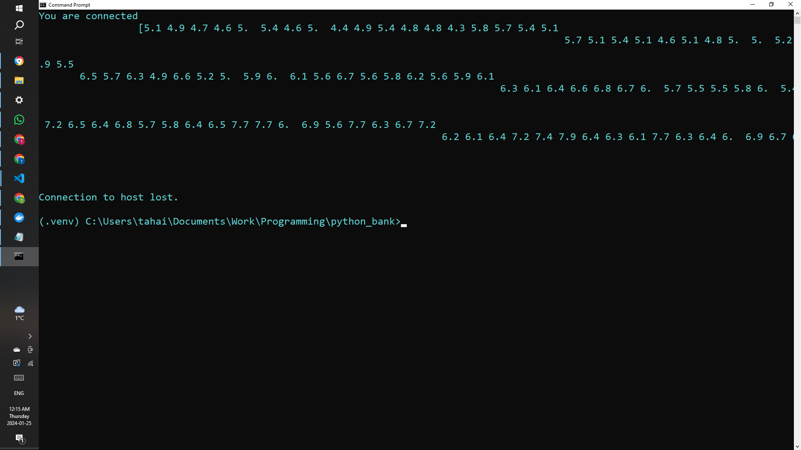
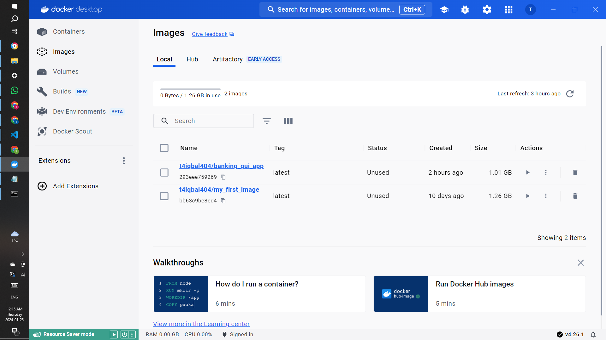
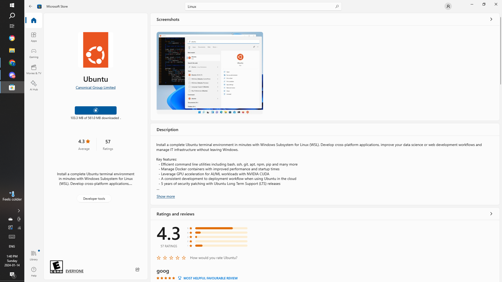

# Dockerizing a TCP-Server Setup-Program
I dockerized a tiny python script that 
sets up a simple python server on port 9999.

The server uses sockets to send data from the Iris dataset (a well-known dataset in machine learning, typically used for classification problems) to a connected client. Demonstrates basic server-client communication using Python's socket library. Uses of the scikit-learn library to load a dataset.

To install docker on my machine, I had to install a Windows Subsystem for Linux

